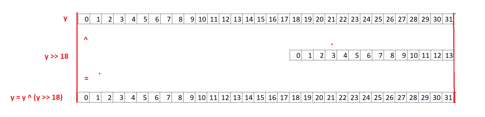
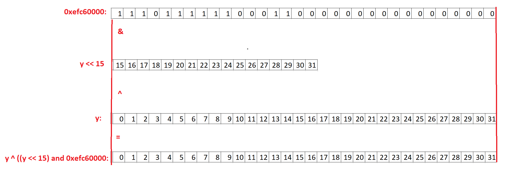
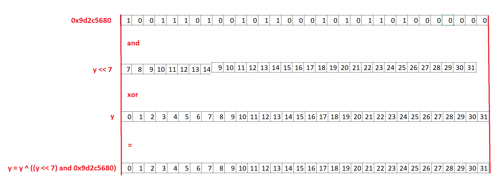

# **[set 3 - challenge 23](https://cryptopals.com/sets/3/challenges/23): Clone an MT19937 RNG from its output**

## Tìm hiểu vấn đề
Như đã miêu tả trong challenge 21: Trong MT19937 có một mảng states gồm 624 phần tử, các số ngẫu nhiên sẽ dựa vào mảng này để sinh ra. Mỗi khi tạo được 624 số ngẫu nhiên, hàm twist() sẽ được gọi để biến đổi 624 phần tử mảng states cũ để tạo ra mảng states mới và tiếp tục tạo số ngẫu nhiên từ mảng mới này.

Nếu như ta có thể lấy được tất cả 624 phần tử trong một mảng states, ta có thể dùng hàm twist() để sinh ra các mảng states kế tiếp => có thể tạo ra một RNG giống y hệt (từ states đó trở đi) mà không cần biết seed của nó.

Theo như đề bài thì ta sẽ dựa vào output: 624 số ngẫu nhiên được sinh ra bởi hàm extract_number() để suy ngược lại 624 phần tử trong states

## Đảo ngược hàm extract_number()
Viết lại quá trình sinh ra một số ngẫu nhiên từ một phần tử trong mảng states (MT):
```
    y = self.MT[self.index]
    y = y ^ (y >> self.u)                   # u = 11
    y = y ^ ((y << self.s) & self.b)        # s = 7 , b = 0x9d2c5680 
    y = y ^ ((y << self.t) & self.c)        # t = 15, c = 0xefc60000
    y = y ^ (y >> self.l)                   # l = 18
    y = y & ((1 << self.w) - 1)
```
Thay số:
```
    y = state
    y = y ^ (y >> 11)
    y = y ^ ((y << 7) & 0x9d2c5680)
    y = y ^ ((y << 15) & 0xefc60000)
    y = y ^ (y >> 18)  
    y = y & (0xffffffff)
```
Quy ước:
- `y mới`: y vế trái
- `y ban đầu`: y vế phải
- sử dụng indexing như python, cấp độ bit: `y mới`[:18] nghĩa là 18 bit đầu tiên của `y mới`

Ta đi ngược từ dưới lên, mục tiêu là từ `y mới`, tìm `y ban đầu` cuối cùng, chính là state:
- y = y & (0xffffffff):
    - Do y không quá 32 bit nên phép toán này coi như bỏ
- y = y ^ (y >> 18):
    - Hình vẽ minh họa:

    

    - `y ban đầu`[:18] = `y mới`[:18]
    - `y ban đầu`[18:] = `y ban đầu`[:14] ^ `y mới`[18:]

- y = y ^ ((y << 15) & 0xefc60000)
    - Hình vẽ minh họa:
    
    

    - `y ban đầu`[15:] = `y mới`[15:]
    - `y ban đầu`[:15] = `y mới`[:15] ^ (0xefc6 and `y ban đầu`[15:31])
- Tương tự đối với 2 phép toán cuối cùng, do phép toán shift nên hàm xor bị hở, ta có thể dần dần tính ra từng bit của `y ban đầu`
<!-- - y = y ^ ((y << 7) & 0x9d2c5680)
    - Hình vẽ minh họa:
    
    

    - `y ban đầu`[25:] = `y mới`[25:]
    - `y ban đầu`[18:25] = `y mới`[18:25] ^ (`0x9d2c5680`[18:25] and `y ban đầu`[25:])
    - `y ban đầu`[11:18] = `y mới`[11:18] ^ (`0x9d2c5680`[11:18] and `y ban đầu`[18:25])
    - `y ban đầu`[4:11] = `y mới`[4:11] ^ (`0x9d2c5680`[4:11] and `y ban đầu`[11:18])
    - `y ban đầu`[:4] = `y mới`[:4] ^ (`0x9d2c5680`[:4] and `y ban đầu`[7:11])
    - :((

- y = y ^ (y >> 11)
    - Tương tư như mấy câu trên
    - `y ban đầu`[:11] = `y mới`[:11]
    - `y ban đầu`[11:22] = `y mới`[11:22] ^ `y ban đầu`[:11]
    - `y ban đầu`[22:] = `y mới`[22:] ^ `y ban đầu`[11:21] -->

=> tìm được state

## Code
Tổng cộng có 2 phép toán rightshift rồi xor, và 2 phép toán leftshift, and xong xor: ta viết 2 hàm invert_rightshift_xor() và invert_leftshift_and_xor().
- invert_rightshift_xor():
```

```

## References

